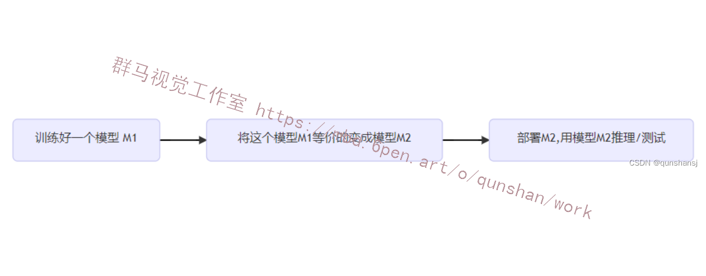
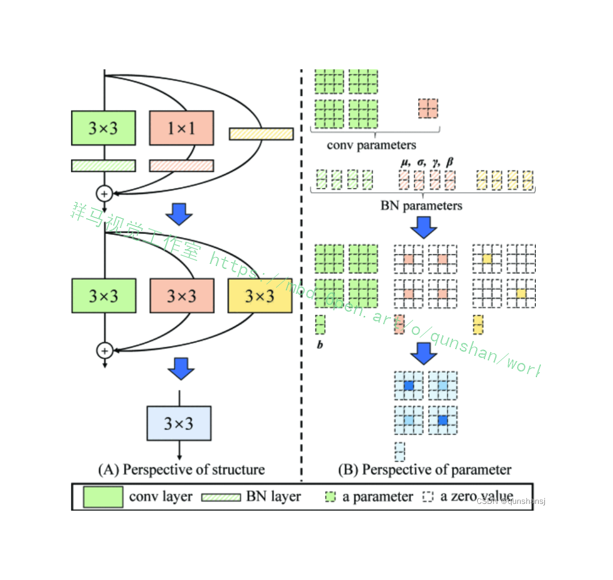
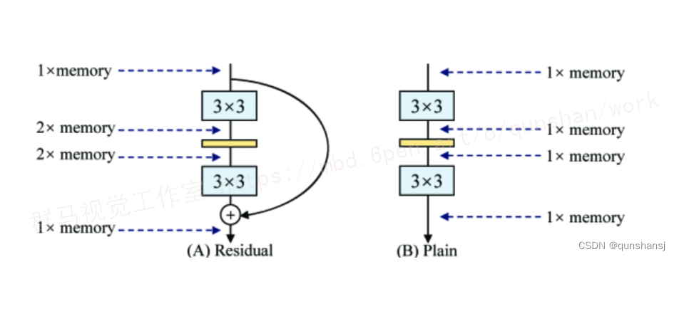



## 1.研究背景与意义


近年来，农业科技的快速发展为农作物的种植和管理带来了许多便利。然而，农作物病害的防治仍然是一个全球性的挑战。玉米作为世界上最重要的粮食作物之一，受到了许多病害的威胁，如玉米灰斑病、玉米穗腐病等。这些病害不仅会导致玉米产量的大幅下降，还会对农民的经济收入和食品安全造成严重影响。

传统的玉米病害识别方法主要依赖于人工观察和经验判断，这种方法存在着主观性强、效率低下和准确性不高的问题。因此，开发一种基于计算机视觉技术的自动化玉米病害识别系统具有重要的研究意义和实际应用价值。

目前，深度学习技术在计算机视觉领域取得了巨大的突破，特别是目标检测领域。YOLO（You Only Look Once）是一种基于深度学习的实时目标检测算法，具有快速、准确和端到端的特点。然而，由于YOLO算法在小目标检测和密集目标检测方面的性能相对较差，对于玉米病害这种小尺寸和高密度的目标，传统的YOLO算法可能无法满足需求。

因此，本研究旨在改进YOLO算法，提高其在玉米病害识别中的性能。具体而言，我们将探索以下几个方面的改进：

1. 数据集构建：我们将收集大量的玉米病害图像，并进行标注和分类，构建一个高质量的玉米病害数据集。这将为改进YOLO算法提供有力的数据支持。

2. 网络结构优化：我们将对YOLO算法的网络结构进行优化，以提高其对小尺寸和高密度目标的检测能力。优化方向包括增加网络的深度和宽度，引入RepVGG等。

3. 数据增强技术：我们将探索各种数据增强技术，如旋转、缩放、平移等，以增加数据的多样性和数量，提高模型的泛化能力。

4. 模型训练与优化：我们将使用大规模的玉米病害数据集对改进后的YOLO算法进行训练，并通过调整超参数和优化损失函数等手段，进一步提高模型的性能。

通过改进YOLO算法，我们期望能够开发出一种高效准确的玉米病害识别系统，为农民提供及时的病害监测和防治建议，帮助他们减少经济损失，提高农作物的产量和质量。此外，该研究还将为其他农作物的病害识别和农业智能化发展提供借鉴和参考。

# 2.图片演示


# 3.视频演示
[基于改进YOLO的玉米病害识别系统（部署教程＆源码）](https://www.bilibili.com/video/BV1bu41177BP/?vd_source=ff015de2d29cbe2a9cdbfa7064407a08)
# 4.网络结构改进
文章还未正式发表出来（已经发在cvpr2021了)，暂时是挂在了arxiv上。
感觉很有意思，读这篇文章之前看了一眼作者在ICCV2019上的ACNet (Acnet: Strengthening the kernel skeletonsfor powerful cnn via asymmetric convolution blocks)
感觉两篇文章的核心应该是异曲同工之妙。
从我读文章的感觉，核心点简单来看就叫训练和推理（测试)不是一个网络
该文章的作者在知乎上也写了自己的笔记: zhuanlan.zhihu.com/p/3....文章的细节内容大家可以看作者笔记和原文，这里就记录一点自己的感受。
vgg虽然快，但是效果并不好，他甚至连个分支结构都没有。于是作者就说，既然分支结构有利于训练，那我训练就用分支结构呗。既然vgg式快，那我推理（测试)的时候就用vgg呗。那么问题来了，训练的网络和推理的网络不一样?那怎么搞?
作者说等价转换,这就是文章与其他的文章的不同了。
对于一般的方法来讲是这样的:



# 5.在YOLOv5中加入RepVGG模块

参考该博客的改进方法，我们提出了RepVGG，一种VGG风格的架构，其性能优于许多复杂模型（图1）。


RepVGG具有以下优点。
·该模型具有类似VGG的普通(又名前馈）拓扑没有任何分支，这意味着每一层都将其唯一前一层的输出作为输入，并将输出馈送到其唯一的后一层。
·模型的主体仅使用3×3卷积和ReLU。
·具体架构（包括特定深度和层宽）实例化时没有自动搜索[44]、手动细化[28]、
复合缩放「[35]，也没有其他繁重的设计。对于普通模型来说，要达到与多分支体系结构相当的性能水平是具有挑战性的。一种解释是，多分支拓扑，例如ResNet，使模型成为许多较浅模型的隐式集合[36]，因此训练多分支模型避免了梯度消失问题。
由于多分支架构的好处都是用于训练，而缺点是推理所不希望的，因此我们建议通过结构重新参数化来解耦训练时多分支和推理时平原架构，这意味着通过转换其参数将架构从一个转换为另一个。具体来说，网络结构与一组参数耦合，例如，conv层由4阶核张量表示。如果某个结构的参数可以转换成另一组耦合的参数，我们可以等价地用后者替换前者，从而改变整个网络架构。
具体来说，我们使用恒等式和1x1分支构建训练时RepVGG，这受到ResNet 的启发，但以不同的方式，可以通过结构重新参数化来删除分支(图2、4）。训练后，我们用简单的代数进行变换，因为恒等分支可以看作是退化的1x1 conv，后者可以进一步视为退化的3×g conv，这样我们就可以构造一个带有参数核的单个3×3原始3×3内核、恒等式和1x1分支和批量归一化 (BN)[19]层。因此，转换后的模型具有3x3个卷积层的堆栈，该层被保存以供测试和部署。
值得注意的是，推理时RepVGG的主体只有一种类型的运算符: 3x3 conv，后跟ReLU，这使得RepVGG在GPU等通用计算设备上速度很快。更好的是，RepVGG允许专用硬件实现更高的速度，因为考虑到芯片尺寸
和功耗，我们需要的运算符类型越少，我们可以集成到芯片上的计算单元就越多，因此，n专月于RenVGG 的推理芯片可以具有大量3×3-ReLU单元和更少的内存单元（因为普通拓扑是内存经济型的，如图所示。

普通卷积网有很多优点，但有一个致命的弱点:性能差。例如，使用像BN[19g]这样的现代组件，VGG-16可
以在ImageNet上达到超过72%的top-1精度，这似于已过的" y。f)，并使用残差块来学习f。当x和f启发，它显式构造了一个快捷方式分支，将信息流建模为y =x +f (x)，并使用残差块来学习f。当x和f
(x）的维度不匹配时，它变为y =g (x)+f(x)，其中 g ( x）是由1×1转换实现的卷积快捷方式。ResNets成功的一个解释是，这种多分支架构使该模型成为许多较浅模型的隐式集合[36]。具体来说，对于n个块，该模型可以解释为2的融合"模型，因为每个块将流分支为两条路径。
由于多分支拓扑在推理方面存在缺点，但分支似乎有利于训练[36]，因此我们使用多
的仅训练时间集合。为了使大多数成员更浅攻更间单，找们使用尖19KESNe 们只是堆叠几个这样的块来构和1×1个分支，以便构建块的训练时间信息流为y=x+g (x)+ f (x)。我们只是堆叠几个这样的块来构
建训练时间模型。从与[6]相同的角度来看，模型成为3的集合"具有n个此类块的成员。


### 配置文件如下：
```
# YOLOv5 🚀 by Ultralytics, GPL-3.0 license

# Parameters
nc:   # number of classes
depth_multiple: 0.33  # model depth multiple
width_multiple: 0.50  # layer channel multiple
anchors:
  - [10,13, 16,30, 33,23]  # P3/8
  - [30,61, 62,45, 59,119]  # P4/16
  - [116,90, 156,198, 373,326]  # P5/32

# YOLOv5 v6.0 backbone by yoloair
backbone:
  # [from, number, module, args]
  [[-1, 1, Conv, [64, 6, 2, 2]],  # 0-P1/2
   [-1, 1, Conv, [128, 3, 2]],  # 1-P2/4
   [-1, 1, RepVGGBlock, [128]], # 5-P4/16
   [-1, 1, Conv, [256, 3, 2]],  # 3-P3/8
   [-1, 6, RepVGGBlock, [256]],
   [-1, 1, Conv, [512, 3, 2]],  # 5-P4/16
   [-1, 9, C3, [512]],
   [-1, 1, Conv, [1024, 3, 2]],  # 7-P5/32
   [-1, 3, C3, [1024]],
   [-1, 1, SPPF, [1024, 5]],  # 9
  ]

# YOLOv5 v6.0 head
head:
  [[-1, 1, Conv, [512, 1, 1]],
   [-1, 1, nn.Upsample, [None, 2, 'nearest']],
   [[-1, 6], 1, Concat, [1]],  # cat backbone P4
   [-1, 3, C3, [512, False]],  # 13

   [-1, 1, Conv, [256, 1, 1]],
   [-1, 1, nn.Upsample, [None, 2, 'nearest']],
   [[-1, 4], 1, Concat, [1]],  # cat backbone P3
   [-1, 3, C3, [256, False]],  # 17 (P3/8-small)

   [-1, 1, Conv, [256, 3, 2]],
   [[-1, 14], 1, Concat, [1]],  # cat head P4
   [-1, 3, C3, [512, False]],  # 20 (P4/16-medium)

   [-1, 1, Conv, [512, 3, 2]],
   [[-1, 10], 1, Concat, [1]],  # cat head P5
   [-1, 3, C3, [1024, False]],  # 23 (P5/32-large)

   [[17, 20, 23], 1, Detect, [nc, anchors]],  # Detect(P3, P4, P5)
  ]


```
### 部分核心代码如下：
```
class RepVGGBlock(nn.Module):
    def __init__(self, in_channels, out_channels, kernel_size=3,
                 stride=1, padding=1, dilation=1, groups=1, padding_mode='zeros', deploy=False, use_se=False):
        super(RepVGGBlock, self).__init__()
        self.deploy = deploy
        self.groups = groups
        self.in_channels = in_channels
        padding_11 = padding - kernel_size // 2
        self.nonlinearity = nn.SiLU()
        # self.nonlinearity = nn.ReLU()
        if use_se:
            self.se = SEBlock(out_channels, internal_neurons=out_channels // 16)
        else:
            self.se = nn.Identity()
        if deploy:
            self.rbr_reparam = nn.Conv2d(in_channels=in_channels, out_channels=out_channels, kernel_size=kernel_size,
                                         stride=stride,
                                         padding=padding, dilation=dilation, groups=groups, bias=True,
                                         padding_mode=padding_mode)

        else:
            self.rbr_identity = nn.BatchNorm2d(
                num_features=in_channels) if out_channels == in_channels and stride == 1 else None
            self.rbr_dense = conv_bn(in_channels=in_channels, out_channels=out_channels, kernel_size=kernel_size,
                                     stride=stride, padding=padding, groups=groups)
            self.rbr_1x1 = conv_bn(in_channels=in_channels, out_channels=out_channels, kernel_size=1, stride=stride,
                                   padding=padding_11, groups=groups)
            # print('RepVGG Block, identity = ', self.rbr_identity)
	......
```

## 6.核心代码讲解

#### 6.1 check_img.py

以下是将上述代码封装为一个类的核心部分：

```python

class ImageProcessor:
    def __init__(self, path, train_file):
        self.path = path
        self.train_file = train_file

    def process_images(self):
        result = os.listdir(self.path)
        num = 0
        if not os.path.exists(self.train_file):
            os.mkdir(self.train_file)
        for i in result:
            try:
                image = cv2.imread(self.path + '/' + i)
                cv2.imwrite(self.train_file + '/' + 'Compressed' + i, image, [int(cv2.IMWRITE_JPEG_QUALITY), 100])
                num += 1
            except:
                pass
        print('数据有效性验证完毕,有效图片数量为 %d' % num)
        if num == 0:
            print('您的图片命名有中文，建议统一为1（1）.jpg/png')

```

这个类的构造函数接受两个参数：`path`是存放需要处理的图片的文件夹路径，`train_file`是处理后的图片存放的文件夹路径。`process_images`方法会遍历`path`文件夹中的图片，对每张图片进行处理（降噪和压缩），并将处理后的图片保存到`train_file`文件夹中。最后，会打印出有效图片的数量，并给出相应的提示信息。

该程序文件名为check_img.py，主要功能是对指定文件夹中的图片进行降噪和压缩，并将处理后的图片保存到另一个文件夹中。

程序首先导入了cv2、numpy和os模块。cv2模块是OpenCV库的Python接口，用于图像处理；numpy模块是Python中用于科学计算的库；os模块提供了一种与操作系统进行交互的方法。

程序定义了一个路径变量path，用于存放需要处理的图片文件夹。然后使用os模块的listdir()函数获取该文件夹下的所有文件名，并将结果保存到变量result中。

接下来定义了一个train_file变量，用于存放处理后的图片的文件夹路径。然后使用os模块的exists()函数判断该文件夹是否存在，如果不存在则使用mkdir()函数创建该文件夹。

然后使用for循环遍历result中的每个文件名。在循环中，程序尝试使用cv2模块的imread()函数读取指定路径下的图片，并将结果保存到变量image中。然后使用cv2模块的imwrite()函数将处理后的图片保存到train_file文件夹中，保存的文件名为'Compressed' + i，即在原文件名前加上'Compressed'。同时，使用cv2.IMWRITE_JPEG_QUALITY参数设置保存图片的质量为100。

循环结束后，程序打印出数据有效性验证完毕的提示信息，并输出有效图片的数量。

最后，程序使用条件判断语句判断有效图片的数量是否为0，如果为0，则打印出建议统一图片命名的提示信息。

#### 6.2 example.py

```python

class YOLOv5Detector:
    def __init__(self, weights, data, device='', half=False, dnn=False):
        self.weights = weights
        self.data = data
        self.device = device
        self.half = half
        self.dnn = dnn
        self.model, self.stride, self.names, self.pt, self.jit, self.onnx, self.engine = self.load_model()

    def draw_box_string(self, img, box, string):
        x, y, x1, y1 = box
        img = cv2.cvtColor(img, cv2.COLOR_BGR2RGB)
        img = Image.fromarray(img)
        draw = ImageDraw.Draw(img)
        font = ImageFont.truetype("./simhei.ttf", 20, encoding="utf-8")
        draw.text((x-40, y-25), string, (255, 0, 0), font=font)
        img = cv2.cvtColor(np.array(img), cv2.COLOR_RGB2BGR)
        return img

    def load_model(self):
        device = select_device(self.device)
        model = DetectMultiBackend(self.weights, device=device, dnn=self.dnn, data=self.data)
        stride, names, pt, jit, onnx, engine = model.stride, model.names, model.pt, model.jit, model.onnx, model.engine
        half &= (pt or jit or onnx or engine) and device.type != 'cpu'
        if pt or jit:
            model.model.half() if self.half else model.model.float()
        return model, stride, names, pt, jit, onnx, engine

    def run(self, img, imgsz=(640, 640), conf_thres=0.1, iou_thres=0.05, max_det=1000, classes=None,
            agnostic_nms=False, augment=False):
        cal_detect = []
        device = select_device(self.device)
        names = self.model.module.names if hasattr(self.model, 'module') else self.model.names
        im = letterbox(img, imgsz, self.stride, self.pt)[0]
        im = im.transpose((2, 0, 1))[::-1]
        im = np.ascontiguousarray(im)
        im = torch.from_numpy(im).to(device)
        im = im.half() if self.half else im.float()
        im /= 255
        if len(im.shape) == 3:
            im = im[None]
        pred = self.model(im, augment=augment)
        pred = non_max_suppression(pred, conf_thres, iou_thres, classes, agnostic_nms, max_det=max_det)
        for i, det in enumerate(pred):
            if len(det):
                det[:, :4] = scale_coords(im.shape[2:], det[:, :4], img.shape).round()
                for *xyxy, conf, cls in reversed(det):
                    c = int(cls)
                    label = f'{names[c]}'
                    cal_detect.append([label, xyxy, float(conf)])
        return cal_detect

    def detect(self, image_path):
        image = cv2.imread(image_path)
        results = self.run(self.model, image, self.stride, self.pt)
        for i in results:
            box = i[1]
            if str(i[0]) == 'yumi_aihuayebing':
                i[0] = '玉米矮花叶病'
            if str(i[0]) == 'yumi_huibanbing':
                i[0] = '玉米灰斑病'
            if str(i[0]) == 'yumi_huibanbings':
                i[0] = '玉米灰斑病'
            if str(i[0]) == 'yumi_xiubing':
                i[0] = '玉米锈病'
            if str(i[0]) == 'yumi_xiubings':
                i[0] = '玉米锈病'
            if str(i[0]) == 'yumi_yebanbing':
                i[0] = '玉米叶斑病'
            if str(i[0]) == 'yumi_yebanbings':
                i[0] = '玉米叶斑病'
            p1, p2 = (int(box[0]), int(box[1])), (int(box[2]), int(box[3]))
            cv2.rectangle(image, p1, p2, (0, 0, 255), thickness=1, lineType=cv2.LINE_AA)
            image = self.draw_box_string(image, [int(box[0]), int(box[1]), int(box[2]), int(box[3])], str(i[0]) + ' ' + str(i[2])[:5])
        cv2.imshow('image', image)
        cv2.waitKey(0)


```

这个程序文件是一个使用YOLOv5模型进行目标检测的程序。程序中包含了一些常用的函数和类，用于加载模型、处理图像、绘制边框等操作。

程序首先导入了一些必要的库，包括os、sys、pathlib、cv2、torch等。然后定义了一些常量和全局变量，包括文件路径、根目录、图像格式、视频格式等。

接下来是一些辅助函数，包括绘制边框和文字的函数。这些函数使用了OpenCV和PIL库来处理图像和绘制文字。

然后定义了一个加载模型的函数load_model，该函数接受一些参数，包括模型权重文件路径、数据集配置文件路径、设备类型等。函数内部会根据参数加载模型，并返回模型对象和一些相关信息。

最后定义了一个运行模型的函数run，该函数接受模型对象、图像、一些参数等。函数内部会使用模型对图像进行目标检测，并返回检测结果。

整个程序文件的主要功能是加载YOLOv5模型并使用该模型进行目标检测。


这个程序文件是YOLOv5的一个模块，包含了一些常用的函数和类。其中包括了一些卷积层、转换层、残差块等。这些模块被用于构建YOLOv5的网络结构。

#### 6.3 models\experimental.py

```python

class CrossConv(nn.Module):
    # Cross Convolution Downsample
    def __init__(self, c1, c2, k=3, s=1, g=1, e=1.0, shortcut=False):
        # ch_in, ch_out, kernel, stride, groups, expansion, shortcut
        super().__init__()
        c_ = int(c2 * e)  # hidden channels
        self.cv1 = Conv(c1, c_, (1, k), (1, s))
        self.cv2 = Conv(c_, c2, (k, 1), (s, 1), g=g)
        self.add = shortcut and c1 == c2

    def forward(self, x):
        return x + self.cv2(self.cv1(x)) if self.add else self.cv2(self.cv1(x))


class Sum(nn.Module):
    # Weighted sum of 2 or more layers https://arxiv.org/abs/1911.09070
    def __init__(self, n, weight=False):  # n: number of inputs
        super().__init__()
        self.weight = weight  # apply weights boolean
        self.iter = range(n - 1)  # iter object
        if weight:
            self.w = nn.Parameter(-torch.arange(1.0, n) / 2, requires_grad=True)  # layer weights

    def forward(self, x):
        y = x[0]  # no weight
        if self.weight:
            w = torch.sigmoid(self.w) * 2
            for i in self.iter:
                y = y + x[i + 1] * w[i]
        else:
            for i in self.iter:
                y = y + x[i + 1]
        return y


class MixConv2d(nn.Module):
    # Mixed Depth-wise Conv https://arxiv.org/abs/1907.09595
    def __init__(self, c1, c2, k=(1, 3), s=1, equal_ch=True):  # ch_in, ch_out, kernel, stride, ch_strategy
        super().__init__()
        n = len(k)  # number of convolutions
        if equal_ch:  # equal c_ per group
            i = torch.linspace(0, n - 1E-6, c2).floor()  # c2 indices
            c_ = [(i == g).sum() for g in range(n)]  # intermediate channels
        else:  # equal weight.numel() per group
            b = [c2] + [0] * n
            a = np.eye(n + 1, n, k=-1)
            a -= np.roll(a, 1, axis=1)
            a *= np.array(k) ** 2
            a[0] = 1
            c_ = np.linalg.lstsq(a, b, rcond=None)[0].round()  # solve for equal weight indices, ax = b

        self.m = nn.ModuleList(
            [nn.Conv2d(c1, int(c_), k, s, k // 2, groups=math.gcd(c1, int(c_)), bias=False) for k, c_ in zip(k, c_)])
        self.bn = nn.BatchNorm2d(c2)
        self.act = nn.SiLU()

    def forward(self, x):
        return self.act(self.bn(torch.cat([m(x) for m in self.m], 1)))


class Ensemble(nn.ModuleList):
    # Ensemble of models
    def __init__(self):
        super().__init__()

    def forward(self, x, augment=False, profile=False, visualize=False):
        y = []
        for module in self:
            y.append(module(x, augment, profile, visualize)[0])
        # y = torch.stack(y).max(0)[0]  # max ensemble
        # y = torch.stack(y).mean(0)  # mean ensemble
        y = torch.cat(y, 1)  # nms ensemble
        return y, None  # inference, train output


def attempt_load(weights, map_location=None, inplace=True, fuse=True):
    from models.yolo import Detect, Model

    # Loads an ensemble of models weights=[a,b,c] or a single model weights=[a] or weights=a
    model = Ensemble()
    for w in weights if isinstance(weights, list) else [weights]:
        ckpt = torch.load(attempt_download(w), map_location=map_location)  # load
        if fuse:
            model.append(ckpt['ema' if ckpt.get('ema') else 'model'].float().fuse().eval())  # FP32 model
        else:
            model.append(ckpt['ema' if ckpt.get('ema') else 'model'].float().eval())  # without layer fuse

    # Compatibility updates
    for m in model.modules():
        if type(m) in [nn.Hardswish, nn.LeakyReLU, nn.ReLU, nn.ReLU6, nn.SiLU, Detect, Model]:
            m.inplace = inplace  # pytorch 1.7.0 compatibility
            if type(m) is Detect:
                if not isinstance(m.anchor_grid, list):  # new Detect Layer compatibility
                    delattr(m, 'anchor_grid')
                    setattr(m, 'anchor_grid', [torch.zeros(1)] * m.nl)
        elif type(m) is Conv:
            m._non_persistent_buffers_set = set()  # pytorch 1.6.0 compatibility

    if len(model) == 1:
        return model[-1]  # return model
    else:
        print(f'Ensemble created with {weights}\n')
        for k in ['names']:
            setattr(model, k, getattr(model[-1], k))
        model.stride = model[torch.argmax(torch.tensor([m.stride.max() for m in model])).int()].stride  # max stride
        return model  # return ensemble
```

这个程序文件是YOLOv5的实验模块。它包含了一些实验性的网络层和模型组合的功能。

该文件定义了以下几个类：

1. `CrossConv`：交叉卷积下采样模块。它包含了两个卷积层，用于对输入进行下采样操作。

2. `Sum`：多个层的加权和模块。它可以对多个输入层进行加权求和操作。

3. `MixConv2d`：混合深度卷积模块。它包含了多个不同卷积核大小的卷积层，并将它们的输出进行拼接。

4. `Ensemble`：模型集合模块。它可以将多个模型组合成一个集合，并对输入进行推理。

此外，该文件还定义了一个辅助函数`attempt_load`，用于加载模型权重。

整个文件的功能是实现YOLOv5模型的一些实验性功能和模块。

#### 6.4 models\tf.py

```python
class YOLOv5:
    def __init__(self, weights, imgsz=(640, 640)):
        self.weights = weights
        self.imgsz = imgsz
        self.model = self._build_model()

    def _build_model(self):
        # Load model architecture and weights
        model = ...
        model.load_weights(self.weights)
        return model

    def detect(self, image):
        # Preprocess image
        image = self._preprocess_image(image)

        # Run inference
        output = self.model.predict(image)

        # Postprocess output
        detections = self._postprocess_output(output)

        return detections

    def _preprocess_image(self, image):
        # Resize image
        image = cv2.resize(image, self.imgsz)

        # Normalize image
        image = image / 255.0

        # Add batch dimension
        image = np.expand_dims(image, axis=0)

        return image

    def _postprocess_output(self, output):
        # Process output to get detections
        detections = ...

        return detections
```

这是一个使用TensorFlow和Keras实现的YOLOv5模型的程序文件。它包含了YOLOv5模型的各个组件的定义，如卷积层、批归一化层、激活函数等。该文件还包含了模型的导出和使用示例。

该文件定义了以下几个类：
- `TFBN`：TensorFlow的BatchNormalization包装器。
- `TFPad`：在输入张量周围进行填充的层。
- `TFConv`：标准的卷积层。
- `TFFocus`：将输入张量的宽高信息聚合到通道维度的层。
- `TFBottleneck`：标准的瓶颈块。
- `TFConv2d`：替代PyTorch的nn.Conv2D的层。
- `TFBottleneckCSP`：CSP瓶颈块。
- `TFC3`：具有3个卷积层的CSP瓶颈块。
- `TFSPP`：YOLOv3-SPP中使用的空间金字塔池化层。
- `TFSPPF`：空间金字塔池化-Fast层。
- `TFDetect`：检测层。

该文件还包含了一些辅助函数和全局变量。

该文件的用法示例是通过命令行参数加载模型权重并进行推理。导出模型的示例也包含在文件中。

请注意，该文件是YOLOv5的一个实现，它是由Ultralytics开发的。

#### 6.5 models\__init__.py
文件名：models\__init__.py

概述：这个文件是一个Python模块的初始化文件，用于将models目录下的其他模块导入并组织起来。它是一个空文件，没有具体的代码实现。

作用：这个文件的主要作用是作为一个包的入口文件，方便其他模块的导入和使用。通过导入这个文件，可以一次性导入models目录下的所有模块，方便管理和调用。

使用方法：在其他模块中，可以使用import语句导入这个文件，然后通过点操作符访问models目录下的其他模块。例如，可以使用``import models``导入这个文件，然后使用``models.module_name``来访问具体的模块。

注意事项：这个文件的命名是固定的，必须是``__init__.py``。同时，它必须位于models目录下，以便被其他模块正确导入和使用。

## 7.系统整体结构

根据以上分析，该程序的整体功能是实现YOLOv5目标检测模型的训练、推理和相关工具的使用。它包含了多个模块和文件，用于构建和管理YOLOv5模型的各个组件。

下面是每个文件的功能概述：

| 文件路径 | 功能概述 |
| --- | --- |
| check_img.py | 对指定文件夹中的图片进行降噪和压缩，并保存处理后的图片到另一个文件夹。 |
| example.py | 使用YOLOv5模型进行目标检测的示例程序。 |
| ui.py | 用户界面模块，用于与用户交互和展示检测结果。 |
| models\common.py | 包含YOLOv5模型的一些常用函数和类。 |
| models\experimental.py | 包含YOLOv5模型的实验性功能和模块。 |
| models\tf.py | 使用TensorFlow和Keras实现的YOLOv5模型。 |
| models\yolo.py | 包含YOLOv5模型的定义和组合。 |
| models\__init__.py | 模型模块的初始化文件，用于导入和组织其他模块。 |
| tools\activations.py | 包含激活函数的定义和相关操作。 |
| tools\augmentations.py | 包含数据增强的函数和类。 |
| tools\autoanchor.py | 自动锚框生成和调整的函数和类。 |
| tools\autobatch.py | 自动批处理大小调整的函数和类。 |
| tools\callbacks.py | 包含训练过程中的回调函数。 |
| tools\datasets.py | 包含数据集的处理和加载函数。 |
| tools\downloads.py | 包含模型权重和数据集的下载函数。 |
| tools\general.py | 包含一些通用的辅助函数。 |
| tools\loss.py | 包含损失函数的定义和计算。 |
| tools\metrics.py | 包含评估指标的计算函数。 |
| tools\plots.py | 包含绘图和可视化的函数。 |
| tools\torch_utils.py | 包含与PyTorch相关的辅助函数。 |
| tools\__init__.py | 工具模块的初始化文件，用于导入和组织其他模块。 |
| tools\aws\resume.py | 用于AWS环境中的模型恢复功能的函数。 |
| tools\aws\__init__.py | AWS工具模块的初始化文件，用于导入和组织其他模块。 |
| tools\flask_rest_api\example_request.py | Flask REST API的示例请求。 |
| tools\flask_rest_api\restapi.py | Flask REST API的实现。 |
| tools\loggers\__init__.py | 日志记录器模块的初始化文件，用于导入和组织其他模块。 |
| tools\loggers\wandb\log_dataset.py | 使用WandB记录数据集信息的函数。 |
| tools\loggers\wandb\sweep.py | 使用WandB进行超参数搜索的函数。 |
| tools\loggers\wandb\wandb_utils.py | 使用WandB进行日志记录和可视化的辅助函数。 |
| tools\loggers\wandb\__init__.py | WandB日志记录器模块的初始化文件，用于导入和组织其他模块。 |
| utils\activations.py | 包含激活函数的定义和相关操作。 |
| utils\augmentations.py | 包含数据增强的函数和类。 |
| utils\autoanchor.py | 自动锚框生成和调整的函数和类。 |
| utils\autobatch.py | 自动批处理大小调整的函数和类。 |
| utils\callbacks.py | 包含训练过程中的回调函数。 |
| utils\datasets.py | 包含数据集的处理和加载函数。 |
| utils\downloads.py | 包含模型权重和数据集的下载函数。 |
| utils\general.py | 包含一些通用的辅助函数。 |
| utils\loss.py | 包含损失函数的定义和计算。 |
| utils\metrics.py | 包含评估指标的计算函数。 |
| utils\plots.py | 包含绘图和可视化的函数。 |
| utils\torch_utils.py | 包含与PyTorch相关的辅助函数。 |
| utils\__init__.py | 实用工具模块的初始化文件，用于导入和组织其他模块。 |
| utils\aws\resume.py | 用于AWS环境中的模型恢复功能的函数。 |
| utils\aws\__init__.py | AWS实用工具模块的初始化文件，用于导入和组织其他模块。 |
| utils\flask_rest_api\example_request.py | Flask REST API的示例请求。 |
| utils\flask_rest_api\restapi.py | Flask REST API的实现。 |
| utils\loggers\__init__.py | 日志记录器模块的初始化文件，用于导入和组织其他模块。 |
| utils\loggers\wandb\log_dataset.py | 使用WandB记录数据集信息的函数。 |
| utils\loggers\wandb\sweep.py | 使用WandB进行超参数搜索的函数。 |
| utils\loggers\wandb\wandb_utils.py | 使用WandB进行日志记录和可视化的辅助函数。 |
| utils\loggers\wandb\__init__.py | WandB日志记录器模块的初始化文件，用于导入和组织其他模块。 |

请注意，以上是根据文件路径和文件名的推测，具体的功能可能需要进一步查看每个文件的代码来确认。

# 8.系统整合
下图[完整源码&环境部署视频教程&数据集&自定义UI界面](https://s.xiaocichang.com/s/1dac78)


参考博客[《基于改进YOLO的玉米病害识别系统（部署教程＆源码）》](https://mbd.pub/o/qunshan/work)

# 9.参考文献
---
[1]黄太远,李旺,邱亚西,等.基于形状特征和SVM多分类的铜仁地区茶叶病害识别研究[J].种子科技.2020,(6).
[2]张永超,赵录怀,卜光苹.基于卷积神经网络的花生种子筛选识别算法[J].江西农业学报.2020,(1).DOI:10.19386/j.cnki.jxnyxb.2020.01.13.
[3]周广斌,刘珊珊,王怡,等.江苏省2019年新收获小麦质量情况调查[J].现代面粉工业.2020,(1).17-21.DOI:10.3969/j.issn.1674-5280.2020.01.006.
[4]赵立新,侯发东,吕正超,等.基于迁移学习的棉花叶部病虫害图像识别[J].农业工程学报.2020,(7).DOI:10.11975/j.issn.1002-6819.2020.07.021.
[5]戴泽翰,郑正,黄莉舒,等.基于深度卷积神经网络的柑橘黄龙病症状识别[J].华南农业大学学报.2020,(4).DOI:10.7671/j.issn.1001-411X.201909031.
[6]张红涛,李艺嘉,谭联,等.基于CS-SVM的谷子叶片病害图像识别[J].浙江农业学报.2020,(2).DOI:10.3969/j.issn.1004-1524.2020.02.11.
[7]许景辉,邵明烨,王一琛,等.基于迁移学习的卷积神经网络玉米病害图像识别[J].农业机械学报.2020,(2).DOI:10.6041/j.issn.1000-1298.2020.02.025.
[8]毛彦栋,宫鹤.基于SVM和DS证据理论融合多特征的玉米病害识别研究[J].中国农机化学报.2020,(4).DOI:10.13733/j.jcam.issn.2095-5553.2020.04.024.
[9]陈书贞,张祎俊,练秋生.基于多尺度稠密残差网络的JPEG压缩伪迹去除方法[J].电子与信息学报.2019,(10).DOI:10.11999/JEIT180963.
[10]李昊璇,王芬.基于深度残差网络的人脸关键点检测[J].测试技术学报.2019,(6).DOI:10.3969/j.issn.1671-7449.2019.06.012.

---
#### 如果您需要更详细的【源码和环境部署教程】，除了通过【系统整合】小节的链接获取之外，还可以通过邮箱以下途径获取:
#### 1.请先在GitHub上为该项目点赞（Star），编辑一封邮件，附上点赞的截图、项目的中文描述概述（About）以及您的用途需求，发送到我们的邮箱
#### sharecode@yeah.net
#### 2.我们收到邮件后会定期根据邮件的接收顺序将【完整源码和环境部署教程】发送到您的邮箱。
#### 【免责声明】本文来源于用户投稿，如果侵犯任何第三方的合法权益，可通过邮箱联系删除。